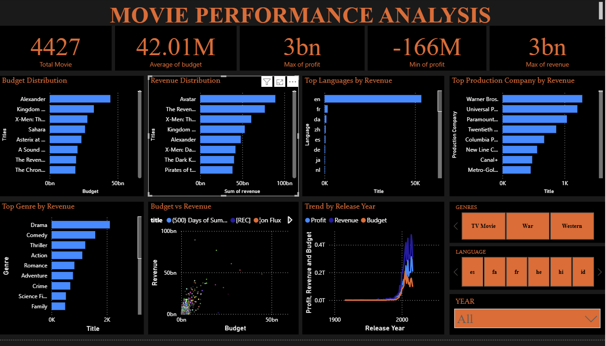

# 🎬 Box Office Success Prediction Model  

## 📌 Project Overview  
This project aims to predict the **box office success of movies** using machine learning models. By leveraging historical movie data and features such as budget, runtime, genre, and original lanuguage, the model classifies movies as **successful** or **not successful**.  

The project also includes **Power BI visualizations** to better understand trends in the movie industry.  

---

## ⚙️ Models Implemented  
We experimented with multiple models to evaluate performance:  

- **Logistic Regression**  
- **Random Forest Classifier**  
- **XGBoost Classifier**  

---

## 📊 Model Performance  

| Model                | Accuracy | Precision | Recall | F1-Score |
|-----------------------|----------|-----------|--------|----------|
| Logistic Regression   | 0.76     | 0.77      | 0.75   | 0.75     |
| Random Forest         | 0.79     | 0.79      | 0.78   | 0.78     |
| XGBoost               | 0.79     | 0.79      | 0.79   | 0.79     |

---

## 📈 Visualizations  

### 🔹 Power BI Dashboard  
A dashboard was built in **Power BI** to explore movie performance, revenue, and trends:  

  

---

### 🔹 Top Categories  
Top Performing Categories:  

 

---

### 🔹 Distribution Visuals  
General Distribution Visual:  

 

---

### 🔹 Revenue Trends  
Yearly revenue trend and performance analysis:  

  

---

##  Tech Stack  
- **Python** (pandas, scikit-learn, xgboost)  
- **Power BI** for visualization  
- **Jupyter Notebook** for analysis  

---

##  Project Structure  

├── data/ # Dataset used
├── images/ # Screenshots (dashboard, charts, etc.)
├── notebook.ipynb # Model training & evaluation
├── README.md # Project documentation
└── requirements.txt # Python dependencies

---

##  Conclusion  
- Logistic Regression achieved decent performance (76%).  
- Random Forest & XGBoost provided slightly better results (~79%).  
- Power BI dashboards helped visualize **genre trends, revenues, and success patterns**.  

Future improvements could include **deep learning models** and more detailed feature engineering (social media buzz, audience reviews, etc.).  

---

## 👨‍💻 Author  
**SureboyPR**  
📧 [adedoyinvictor2015@gmail.com] | 🌐 [(https://github.com/SureboyPR)]  

